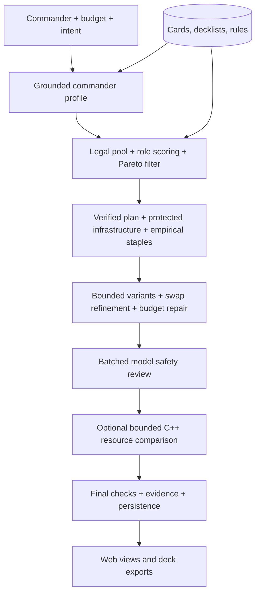

# Commander Deck Generator

[](https://github.com/DylnMtthws/commander-deck-generator/actions/workflows/ci.yml)
[](LICENSE)

**Sabermetrics for Magic: constrained deck optimization with grounded AI reasoning.**

[Hosted application](https://generate.decklab.studio) · [Development](CONTRIBUTING.md) · [Deployment](docs/hosting.md) · [Deck Lab](https://github.com/DylnMtthws/deck-lab)

Give the generator a Commander, a budget, and an optional strategy. It builds a
99-card Commander deck plus its commander, combining deterministic filters and
optimization with language-model analysis of the commander's plan. The original
Sabermetrics web interface supports commander exploration, saved decks, and
multiple deck views. Export formats include text, JSON, Moxfield, and Archidekt.
The hosted instance is restricted to the owner's admin login.

This repository preserves the original generator, extracted from commit
`84b7d9807a846597f4020d1814c16a473584ec56`, immediately before the cEDH Deck Lab
was introduced. Its original Git history is retained. The competitive research,
editing, and simulation product now lives in the separate Deck Lab repository.

## Engineering highlights

- **Constraint-aware optimization.** Color identity, legality, singleton rules,
  deck size, and card prices constrain a pipeline that uses role scoring,
  Pareto filtering, greedy selection, swap refinement, and budget repair.
- **Grounded model use.** Commander profiles combine card text with available
  decklist and reference evidence. A batched safety review inspects risky picks;
  deterministic code owns assembly and final legality checks. Profile identity,
  set, timestamp, and evidence provenance come from trusted inputs. Final deck
  summaries are rendered from selected card facts, without a prose-model call.
- **Prepared, measurable scoring.** Rule matching evaluates each card/rule once
  and combines masks with NumPy. Persistent embeddings require an explicit model
  revision; public-card facts can be prepared separately from user data. A local
  220-card benchmark reproduced the reference matrix with 99.0% less matching time.
- **Executable strategy plans.** Supported landfall intent reserves functional
  enablers and payoffs before pruning, then compares three constrained builds.
  Facts distinguish land access from ramp and preserve unsupported prerequisites
  as visible findings. These are conservative supported shapes, not a full rules engine.
- **C++ experiment boundary.** An optional authenticated adapter compares basic-land
  color substitutions with fixed seeds and fresh confirmation trials. It refuses
  unsupported land mechanics and labels its narrow land/commander scenario; it
  cannot estimate multiplayer win rates. See the [implementation and measured
  limits](docs/specs/informed-generation/validation.md).
- **Durable background work.** SQLite job records expose actual build stages,
  survive browser reloads, and isolate status by owner. A process lock enforces
  one worker; abandoned builds fail visibly after restart instead of silently
  repeating paid requests.
- **Explicit quality contracts.** Supported copy-creature intent becomes a
  protected engine requirement. Final checks distinguish illegal lists from
  unmet strategy, role, or bracket targets. Warnings remain attached to the deck.
- **Cost observability.** A shared model client records token usage and estimated
  cost, retries transient failures, supports prompt caching, and checks a
  configured monthly spend ceiling before calls. Pricing constants and usage
  determine estimates; this is not a guaranteed provider-side billing cap.
- **Data engineering.** Source adapters normalize card/deck/reference material
  into SQLite. Archetype clustering and per-variant inclusion rates let real
  decklists inform candidate selection. Missing sources can reduce evidence.
- **Testable boundaries.** Scoring, parsing, optimization, persistence, auth, and
  model-facing behavior have automated tests. Provider responses are mocked for
  ordinary unit tests; corpus-dependent checks skip when data is unavailable.

## How it works



The model is useful for strategic interpretation, but it is not trusted to
produce a legal list unaided. Price is a constraint, not a proxy for card quality.
See the [spec and operator setup](docs/specs/informed-generation/README.md),
[`intelligence/`](src/sabermetrics/intelligence/), [`pipeline/`](src/sabermetrics/pipeline/),
[`analytics/`](src/sabermetrics/analytics/), and
[`reasoning/`](src/sabermetrics/reasoning/) for the implementation.

## Run locally

Requires Python 3.11+, disk space for the card corpus and CPU embedding model,
and a Hugging Face Inference Providers credential for actual generation.

```sh
git clone https://github.com/DylnMtthws/commander-deck-generator.git
cd commander-deck-generator
python3.11 -m venv .venv
source .venv/bin/activate
pip install -e '.[dev]'
python scripts/setup_db.py
python scripts/initial_ingestion.py --scryfall-only
python scripts/setup_db.py --prepare-corpus
export SABER_OWNER_EMAIL=you@example.com
export SABER_SECRET_KEY="$(python -c 'import secrets; print(secrets.token_hex(32))')"
export SABER_COOKIE_SECURE=0
sabermetrics create-admin --email "$SABER_OWNER_EMAIL"
# Set HF_TOKEN securely in your shell before generating.
sabermetrics serve
```

Open `http://127.0.0.1:5000`. Environment examples are in
[.env.example](.env.example); a `.env` file is not automatically loaded.
The installed command retains its original `sabermetrics` name. Use a separate
virtual environment from Deck Lab, which retains the same Python import namespace.

```sh
sabermetrics build "Korvold, Fae-Cursed King" --budget 150 --output-format text
sabermetrics profile "Korvold, Fae-Cursed King"
sabermetrics health
```

For richer empirical evidence, run `pull-decks`, `cluster-decks`, and
`value-cards` for the commander. These commands require network access and source
availability. Settings, scoring weights, model IDs, and cost estimates live in
[`config/settings.yaml`](config/settings.yaml). Configuration ships inside the wheel;
`config/` links to the same packaged files. `SABER_CONFIG_DIR` can supply an explicit
configuration directory. Schema upgrades are additive; public role tagging and
candidate preparation run separately so normal requests do not repeat that work.

## Model provider and cost

Profile and card-review model calls use Hugging Face Inference Providers, pinned to
`deepseek-ai/DeepSeek-V4-Flash-0731:deepinfra`. Requests go to
`https://router.huggingface.co/v1` and authenticate with `HF_TOKEN`. Create a
[fine-grained token](https://huggingface.co/settings/tokens) with **Make calls to
Inference Providers** permission and enable credits/billing in your Hugging Face
account. This is serverless inference; no dedicated GPU endpoint is needed.
[Hugging Face handles billing at provider rates](https://huggingface.co/docs/inference-providers/en/pricing).

Reasoning is disabled to preserve completion budgets for the existing JSON
parsers; schema validation and legality checks remain in the application.
Prefix caching is automatic at the provider. Pinning the provider keeps routing
and cost estimates predictable.

The cost ledger uses configurable standard-tier estimates of **$0.06 / million
uncached input, $0.015 / million cached input, and $0.18 / million output tokens**.
These are estimates, not invoices; rates were checked September 12, 2026 against
[DeepInfra's model pricing](https://deepinfra.com/deepseek-ai/DeepSeek-V4-Flash-0731/api).
The existing $15 rolling-30-day spend threshold remains configured. Invalid or
truncated answers with valid usage counters are charged to the ledger before
being rejected. Deterministic final summaries add no model cost. Quality is checked with public-card
regressions and bounded integration evaluations; these do not establish win rates.

## Verification and code tour

```sh
pytest -q
ruff check src tests
mypy src
```

Pytest is the historical CI gate. The restored code carries lint/type debt,
reported separately in CI; it is not presented as a fully clean baseline.
Owner-access tests cover non-owner admins, ordinary users, disabled accounts,
revoked sessions, and invite/user-management bypass attempts.

| Directory | Responsibility |
| --- | --- |
| [`analytics/`](src/sabermetrics/analytics/) | Filters, role scores, embeddings, archetype clustering |
| [`pipeline/`](src/sabermetrics/pipeline/) | Assembly, infrastructure packages, optimization, formatting |
| [`reasoning/`](src/sabermetrics/reasoning/) | Model client, profiles, fit analysis, synthesis |
| [`ingestion/`](src/sabermetrics/ingestion/) | Source adapters and refresh support |
| [`reference_layer/`](src/sabermetrics/reference_layer/) | Reference chunking, embeddings, retrieval |
| [`ui/`](src/sabermetrics/ui/) | Flask application, owner authentication, saved deck views |
| [`generation_jobs.py`](src/sabermetrics/generation_jobs.py) | Durable jobs, worker ownership, progress and recovery |
| [`runtime/`](src/sabermetrics/runtime/) | Packaged scoring resources, additive migrations and readiness |
| [`tests/`](tests/) | Unit, regression, and optional corpus-backed tests |

Reviewable acceptance criteria and regression scenarios are in the
[generator quality specification](docs/specs/generator-quality/README.md).

## Tradeoffs and limitations

This is an optimization and reasoning experiment, not a competitive win-rate
predictor or gameplay simulator. Deck quality depends on corpus freshness,
heuristics, and model behavior. Budget enforcement uses available price data,
which can differ from checkout prices. No measured average generation cost or
latency is claimed. Strategy recognition currently supports mana-value-limited
creature copies; other free-form requests are labeled unverified. The protected
copy package conservatively excludes target restrictions it cannot verify and
favors copies that handle the legend rule. A requested
power bracket is a target, not a guarantee. The historical spend check does not reserve budget atomically
across concurrent calls, so concurrent generation may overshoot its threshold.

CPU embeddings make deployment heavier than Deck Lab. A single-host service
bounds operational complexity but does not provide high availability. The
hosted entry point requires an explicit owner email and stable session key;
invites and account-management writes are disabled in owner mode. Model and
data credentials never belong in source control.

Contributions: [CONTRIBUTING.md](CONTRIBUTING.md). Vulnerabilities:
[SECURITY.md](SECURITY.md). Licensed under [MIT](LICENSE).

*Unofficial fan project; not affiliated with Wizards of the Coast. Magic: The
Gathering belongs to its respective owners. Card artwork/data retain their
original rights.*
