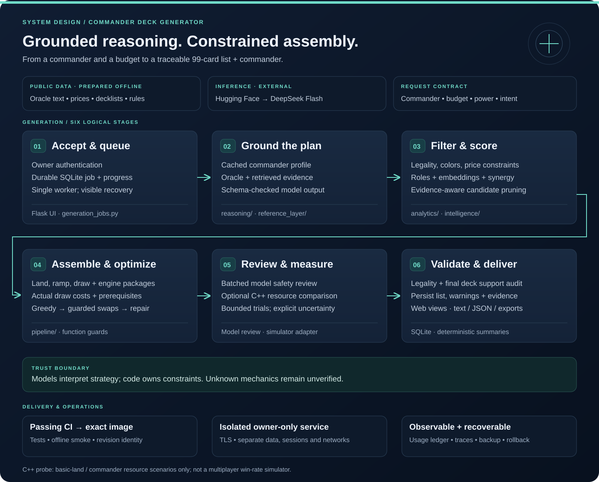

# Commander Deck Generator

[](https://github.com/DylnMtthws/commander-deck-generator/actions/workflows/ci.yml)
[](LICENSE)

**A constrained recommendation system for Magic: The Gathering, combining grounded AI reasoning with deterministic deck construction.**

[Hosted application](https://generate.decklab.studio) · [Architecture](#end-to-end-architecture) · [Validation](#evidence-and-current-release) · [Run locally](#run-locally) · [Contributing](CONTRIBUTING.md)

Choose a commander, budget, power target, and strategy. The generator assembles a
99-card list plus its commander, tracks the build in the browser, and saves the
result with explanations, warnings, and text, JSON, Moxfield, or Archidekt exports.
The hosted instance permits only the owner's admin login; the application can
also run locally.

The engineering problem is larger than asking a model for 100 names: recommendations
must respect legality, color identity, prices, card interactions, conditional
abilities, and incomplete evidence. This project makes those decisions inspectable
through typed model responses, explicit constraints, candidate traces, and
reproducible before/after evaluations.

## End-to-end architecture

[](docs/assets/generator-architecture.svg)

*Six logical stages, with public-data preparation, external inference, and release
operations shown separately. [Open the scalable diagram](docs/assets/generator-architecture.svg).*

1. **Accept and queue.** Flask authenticates the owner and stores a durable SQLite
   job. A single worker reports real pipeline progress; reloads preserve job
   visibility and abandoned work fails explicitly after restart.
2. **Ground the plan.** Hugging Face inference interprets commander strategy using
   Oracle text and available reference evidence. Profiles are schema-validated,
   cached, and tied to evidence provenance.
3. **Filter and score.** Deterministic filters enforce candidate constraints.
   Prepared role facts, embeddings, decklist inclusion, and synergy scores guide
   pruning and recall.
4. **Assemble and optimize.** Infrastructure packages reserve lands, ramp, draw,
   and engine pieces. Greedy selection, swap refinement, and budget repair operate
   with function-preservation checks. Draw routes distinguish printed mana value
   from actual access costs and required support.
5. **Review and measure.** A batched model review checks risky selections. An
   optional C++ adapter compares supported basic-land resource scenarios with
   fixed seeds and fresh confirmation trials. It is not a multiplayer simulator.
6. **Validate and deliver.** Final checks reassess the actual deck, record unmet
   requirements and uncertainty, and persist the result. Final summaries use
   selected card facts without another prose-model call.

## Engineering decisions worth exploring

| Challenge | Implementation and tradeoff |
| --- | --- |
| Trusting model output | Models interpret strategy; deterministic assembly and legality checks own the list. Unknown mechanics remain unverified. [Reasoning](src/sabermetrics/reasoning/) |
| Understanding conditional cards | Draw-route parsing separates casting, Channel, activation, setup, and prerequisites. Giada's mana is conditional; Vivi's variable output is not a fixed discount. [Route compiler](src/sabermetrics/intelligence/draw_routes.py) |
| Avoiding destructive substitutions | Optimizer transactions preserve supported card functions and report rejected changes. Conservative unknowns can prevent useful swaps. [Function guard](src/sabermetrics/intelligence/function_guard.py) |
| Explaining omissions | Candidate traces expose filtering, ranking, reservation, budget, and final membership. Paired runs hold data, profiles, and embeddings constant. [Evaluation evidence](docs/experiments/draw-routes/results.md) |
| Keeping CPU work bounded | Prepared rule masks, NumPy scoring, and revision-pinned embedding caches avoid repeated matching. A bounded 220-card study matched the reference matrix with 99.0% less matching time; this is not an end-to-end latency claim. [Study](docs/specs/informed-generation/validation.md) |
| Operating an AI application | Durable jobs, usage accounting, isolated owner access, exact CI image promotion, backups, and image rollback make failures observable and releases traceable. [Hosting](docs/hosting.md) |

## Evidence and current release

The release enables route-aware draw checks and function-preserving swap/budget
policies in the web worker. Experimental defaults remain available for controlled
comparisons. This improves cost and role reasoning; deck quality is still an open
engineering problem.

- **2,304 local tests passed**, with 21 data-dependent skips. GitHub CI separately
  gates tests and an installed-container smoke; lint and type debt remain report-only.
- **Eight primary paired builds** covered Vivi, Krenko, Giada, and Lathril across
  $51–$200 budgets and power targets 2–3, using pinned local embeddings and exact
  cached profiles. All passed mechanical validation without generation-model calls.
- **A measured correction:** Lathril's two false draw assignments were removed.
  Sanctuary Warden and Moldervine Reclamation remained in their respective decks.
- **A measured limit:** final card membership did not change. The trace identified
  an unscored cheapest-card fallback caused by a fixed per-slot budget reserve.
  [The next-priority spec](docs/experiments/draw-routes/next-priority.md) defines the
  follow-up and acceptance criteria. No win-rate or speed improvement is claimed.

The [full results](docs/experiments/draw-routes/results.md) distinguish primary
runs from degraded-feature controls and record hashes, unknown coverage, and
limitations. The [replay runbook](docs/experiments/draw-routes/replay-runbook.md)
documents the data, profile, and embedding prerequisites needed to repeat the comparison.

## Run locally

Requires Python 3.11+, disk space for the card corpus and CPU embedding model,
and a Hugging Face Inference Providers credential for actual generation.

```sh
git clone https://github.com/DylnMtthws/commander-deck-generator.git
cd commander-deck-generator
python3.11 -m venv .venv
source .venv/bin/activate
pip install -e '.[dev]'
python scripts/setup_db.py
python scripts/initial_ingestion.py --scryfall-only
python scripts/setup_db.py --prepare-corpus
export SABER_OWNER_EMAIL=you@example.com
export SABER_SECRET_KEY="$(python -c 'import secrets; print(secrets.token_hex(32))')"
export SABER_COOKIE_SECURE=0
sabermetrics create-admin --email "$SABER_OWNER_EMAIL"
# Set HF_TOKEN securely in your shell before generating.
sabermetrics serve
```

Open `http://127.0.0.1:5000`. Environment examples are in
[.env.example](.env.example); a `.env` file is not automatically loaded.
The installed command retains its original `sabermetrics` name. Use a separate
virtual environment from Deck Lab, which retains the same Python import namespace.

```sh
sabermetrics build "Korvold, Fae-Cursed King" --budget 150 --output-format text
sabermetrics profile "Korvold, Fae-Cursed King"
sabermetrics health
```

For richer empirical evidence, run `pull-decks`, `cluster-decks`, and
`value-cards` for the commander. These commands require network access and source
availability. Settings, scoring weights, model IDs, and cost estimates live in
[`config/settings.yaml`](config/settings.yaml). Configuration ships inside the wheel;
`config/` links to the same packaged files. `SABER_CONFIG_DIR` can supply an explicit
configuration directory. Schema upgrades are additive; public role tagging and
candidate preparation run separately so normal requests do not repeat that work.

## Model provider and cost

Profile and card-review model calls use Hugging Face Inference Providers, pinned to
`deepseek-ai/DeepSeek-V4-Flash-0731:deepinfra`. Requests go to
`https://router.huggingface.co/v1` and authenticate with `HF_TOKEN`. Create a
[fine-grained token](https://huggingface.co/settings/tokens) with **Make calls to
Inference Providers** permission and enable credits/billing in your Hugging Face
account. This is serverless inference; no dedicated GPU endpoint is needed.
[Hugging Face handles billing at provider rates](https://huggingface.co/docs/inference-providers/en/pricing).

Reasoning is disabled to preserve completion budgets for the existing JSON
parsers; schema validation and legality checks remain in the application.
Prefix caching is automatic at the provider. Pinning the provider keeps routing
and cost estimates predictable.

The cost ledger uses configurable standard-tier estimates of **$0.06 / million
uncached input, $0.015 / million cached input, and $0.18 / million output tokens**.
These are estimates, not invoices; rates were checked September 12, 2026 against
[DeepInfra's model pricing](https://deepinfra.com/deepseek-ai/DeepSeek-V4-Flash-0731/api).
The existing $15 rolling-30-day spend threshold remains configured. Invalid or
truncated answers with valid usage counters are charged to the ledger before
being rejected. Deterministic final summaries add no model cost. Quality is checked with public-card
regressions and bounded integration evaluations; these do not establish win rates.

## Verification and code tour

```sh
pytest -q
ruff check src tests
mypy src
```

Pytest is the historical CI gate. The restored code carries lint/type debt,
reported separately in CI; it is not presented as a fully clean baseline.
Owner-access tests cover non-owner admins, ordinary users, disabled accounts,
revoked sessions, and invite/user-management bypass attempts.

| Directory | Responsibility |
| --- | --- |
| [`analytics/`](src/sabermetrics/analytics/) | Filters, role scores, embeddings, archetype clustering |
| [`pipeline/`](src/sabermetrics/pipeline/) | Assembly, infrastructure packages, optimization, formatting |
| [`reasoning/`](src/sabermetrics/reasoning/) | Model client, profiles, fit analysis, synthesis |
| [`ingestion/`](src/sabermetrics/ingestion/) | Source adapters and refresh support |
| [`reference_layer/`](src/sabermetrics/reference_layer/) | Reference chunking, embeddings, retrieval |
| [`ui/`](src/sabermetrics/ui/) | Flask application, owner authentication, saved deck views |
| [`generation_jobs.py`](src/sabermetrics/generation_jobs.py) | Durable jobs, worker ownership, progress and recovery |
| [`runtime/`](src/sabermetrics/runtime/) | Packaged scoring resources, additive migrations and readiness |
| [`tests/`](tests/) | Unit, regression, and optional corpus-backed tests |

Reviewable acceptance criteria and regression scenarios are in the
[generator quality specification](docs/specs/generator-quality/README.md).

## Tradeoffs and limitations

This is an optimization and reasoning experiment, not a competitive win-rate
predictor or gameplay simulator. Deck quality depends on corpus freshness,
heuristics, and model behavior. Budget enforcement uses available price data,
which can differ from checkout prices. No measured average generation cost or
latency is claimed. Strategy recognition currently supports mana-value-limited
creature copies; other free-form requests are labeled unverified. The protected
copy package conservatively excludes target restrictions it cannot verify and
favors copies that handle the legend rule. A requested
power bracket is a target, not a guarantee. The historical spend check does not reserve budget atomically
across concurrent calls, so concurrent generation may overshoot its threshold.

CPU embeddings make deployment heavier than Deck Lab. A single-host service
bounds operational complexity but does not provide high availability. The
hosted entry point requires an explicit owner email and stable session key;
invites and account-management writes are disabled in owner mode. Model and
data credentials never belong in source control.

## Project origin

Originally named Sabermetrics, this generator was extracted from commit
`84b7d9807a846597f4020d1814c16a473584ec56`, immediately before the cEDH Deck Lab
was introduced. Original Git history is retained. The separate
[Deck Lab repository](https://github.com/DylnMtthws/deck-lab) contains the competitive
research, editing, and simulation product; the generator has its own deployment,
data, and authentication boundary.

Contributions: [CONTRIBUTING.md](CONTRIBUTING.md). Vulnerabilities:
[SECURITY.md](SECURITY.md). Licensed under [MIT](LICENSE).

*Unofficial fan project; not affiliated with Wizards of the Coast. Magic: The
Gathering belongs to its respective owners. Card artwork/data retain their
original rights.*
